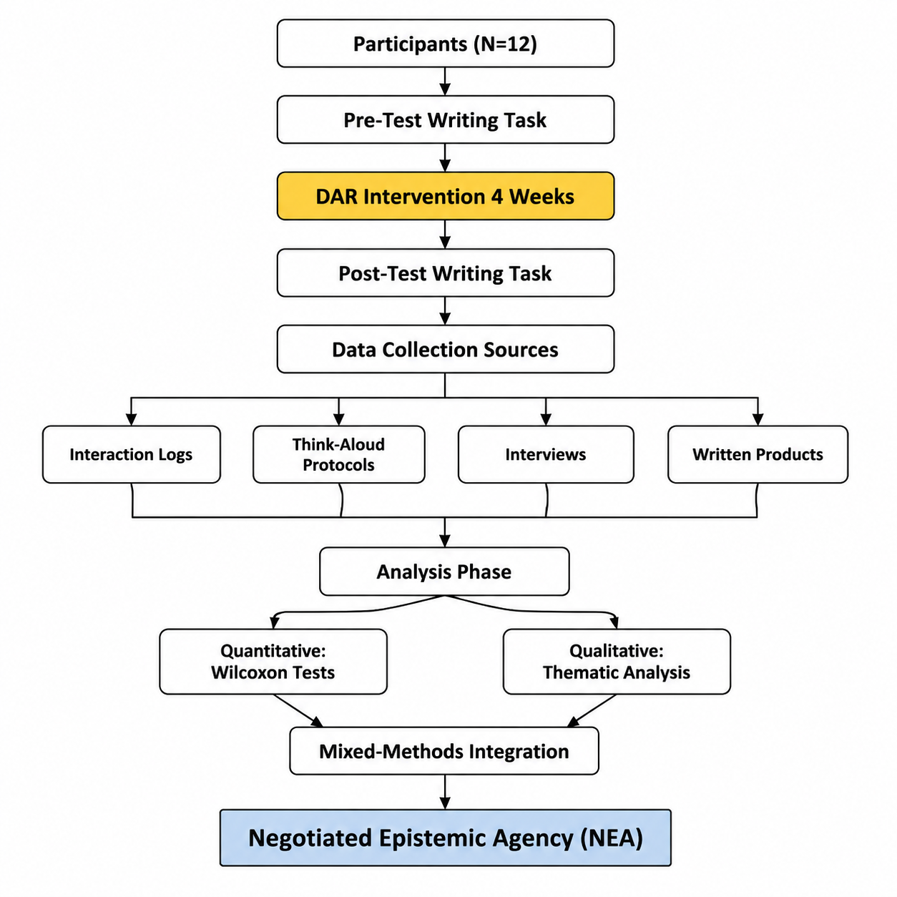
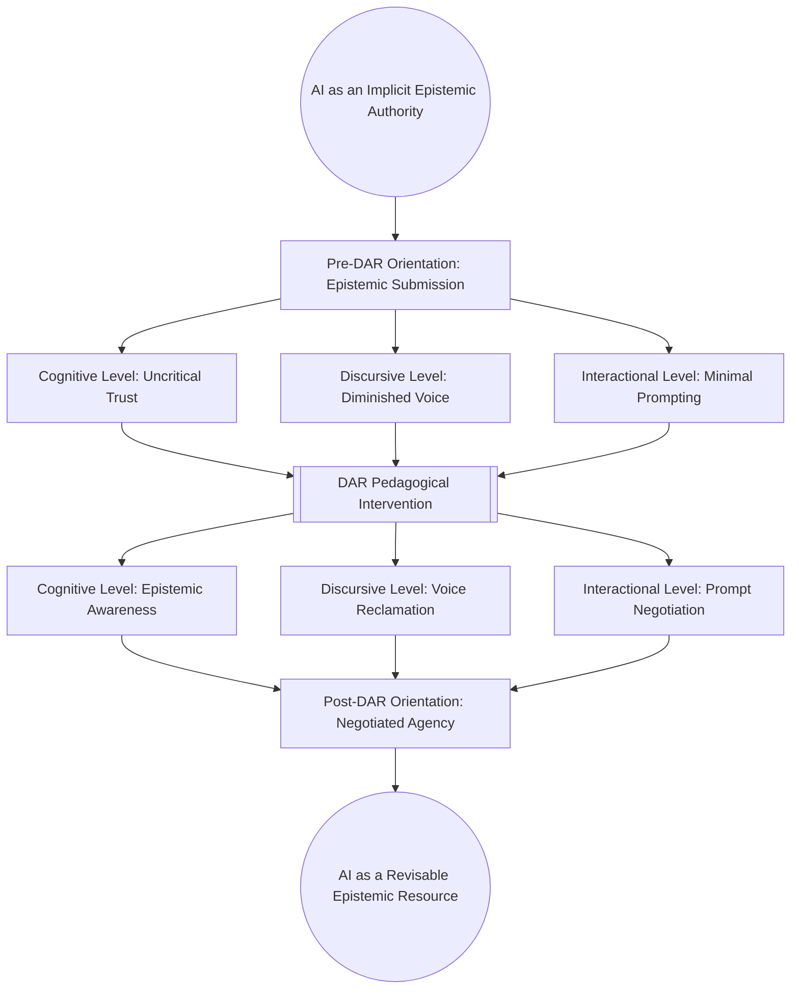
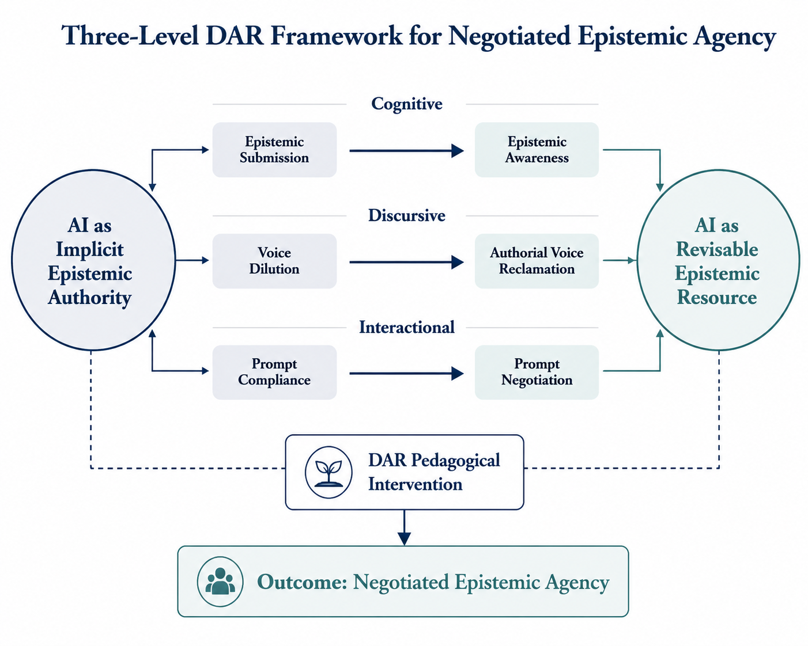
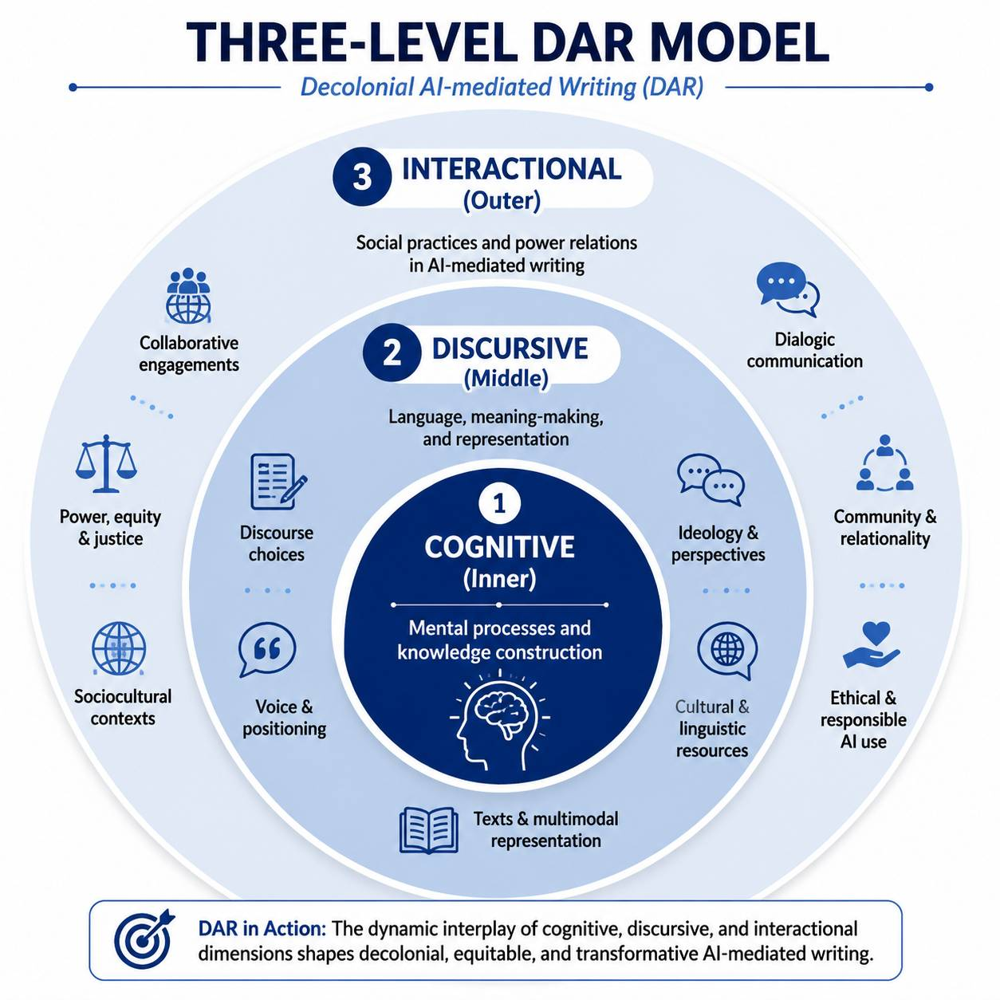

# Decolonizing the Algorithm (DAR)
‌
## 📝 Project Description
This research investigates the development of Negotiated Epistemic Agency (NEA). It explores how learners transition from passive users to critical negotiators of knowledge while interacting with algorithmic systems.
‌
## 🔬 Research Methodology
The study employs a Mixed-Methods Research Design to capture both statistical trends and deep qualitative insights:
‌

Preparation: Starts with 12 participants (N=12) and a Pre-Test to establish a baseline.
Intervention: A 4-week DAR (Decolonizing the Algorithm) program.
Evaluation: A Post-Test to measure development after the intervention.
Data Triangulation:
   💻 Interaction Logs: Quantitative tracking of behavior.
   🧠 Think-Alouds: Real-time cognitive process mapping.
*   🗣 Interviews: In-depth qualitative reflections.
Synthesis: Quantitative + Qualitative Analysis integrated through Mixed-Methods Integration.
‌
## 🎯 Key Outcome
- Negotiated Epistemic Agency (NEA): The main goal of this workflow is to foster learners' ability to negotiate their knowledge-building process in digital environments.
```


## Research Methodology
‌
This study employs a **Mixed-Methods Research Design** to investigate the impact of the DAR intervention over a 4-week period.
‌
### 🔍 Key Components:
- **Intervention:** A 4-week DAR (Decolonizing the Algorithm) program.
- **Data Sources:**
- *Interaction Logs* & *Written Products* (Quantitative)
- *Think-Aloud Protocols* & *Interviews* (Qualitative)
- **Analysis:** Integration of Wilcoxon signed-rank tests for statistical significance and Thematic Analysis for qualitative insights.
- **Goal:** To evaluate and foster **Negotiated Epistemic Agency (NEA)** among participants (N=12).
# 🚀 Decolonizing the Algorithm: The DAR Model
‌
This repository presents the **Decolonial AI-mediated Writing (DAR)** framework. 
The model below illustrates the transformative journey from *Epistemic Submission* to *Negotiated Epistemic Agency*
 


Decolonizing the Algorithm (DAR) Model
Structuralository contains the supplementary materials, pedagogical protocols, and validation instruments for the study:
"Decolonizing the Algorithm: Epistemic Agency, Authorial Voice, and Critical AI Literacy in L2 Academic Writing" (20Responsible� Overview
The DAR Model is a transformative pedagogical framework designed to transition L2 writers from passive AI reliance (Epistemic Submission) to critical, agentic interaction (Negotiated Epistemic Agency).
‌
## 📂 Repository Structure
Referencing the framework architecture, this repository is organized as follows:
- `Intervention-Protocol/`: Step-by-step guides for the 3-stage DAR training.
- `Instruments/`: The Epistemic Agency Checklist (EAC) and Authorial Voice Rubric (AVR).
- `Data-Analysis/`: Statistical outputs and Wilcoxon Signed-Rank test results.
- `Figures/`: Visual representations of the DAR Framework and Recursive Cycle.
‌
## 🛠 Key Dimensions of DAR

Cognitive: Shifting from AI-as-Authority to AI-as-Resource.
Discursive: Reclaiming authorial voice and resisting linguistic flattening.
Interactional: Strategic negotiation through "Resisting Prompts."
‌
## 📜 Citation
If you use this model or these instruments in your research, please cite:
Merrikhi, P. (2026).  
Decolonizing the Algorithm: Epistemic Agency, Authorial Voice, and Critical AI Literacy in L2 Academic Writing.
‌
## ✉️ Contact
Dr. Pegah Merrikhi Deniz.qizi@gmail.com
# Decolonizing the Algorithm (DAR): A Framework for Epistemic Agency
‌
Welcome to the official repository for the research project: **"Decolonizing the Algorithm: Reclaiming Epistemic Agency in AI-Mediated L2 Writing"**.
‌
This repository contains the pedagogical protocols, assessment instruments, and statistical findings developed by **Dr. Pegah Merrikhi**.
‌
## 🎯 Overview
The **DAR Framework** is designed to counteract "Algorithmic Flattening"—the tendency of Generative AI to sanitize cultural nuances and authorial voice in L2 writing. This model empowers writers to move from *Epistemic Submission* to *Negotiated Agency*.
‌
## 📂 Repository Navigation
‌
To explore the components of the DAR intervention, please use the links below:
‌
### 1. [Intervention Protocol](./Intervention-Protocol/)
Detailed lesson plans for the three-stage intervention:
- **[Stage 1: Deconstruction](./Intervention-Protocol/stage-1-deconstruction.md)** - Raising critical AI awareness.
- **[Stage 2: Agency Training](./Intervention-Protocol/stage-2-agency-training.md)** - Learning to "talk back" to the algorithm.
- **[Stage 3: Reframing](./Intervention-Protocol/stage-3-reframing.md)** - Consolidating agentic writing habits.
‌
### 2. [Assessment Instruments](./Instruments/assessment-tools.md)
Tools developed to measure the impact of the DAR model:
- Epistemic Agency Checklist (EAC)
- Authorial Voice Rubric (AVR)
‌
### 3. [Research Findings](./Data-Analysis/findings.md)
Summary of the statistical analysis (Wilcoxon Signed-Rank Test) and qualitative shifts observed during the study.
‌
### 4. [Appendix: Resisting Prompts](./resisting-prompts-guide.md)
A curated list of "Resisting Prompts" designed to help L2 writers preserve their rhetorical identity.
‌
## 📊 Key Visuals
The conceptual models and data visualizations are available in the **[`/Figures`](./Figures/)** folder.
‌
## 📝 Citation
If you use this framework or the instruments in your research, please cite:
> *Merrikhi, P. (2026). Decolonizing the Algorithm: Reclaiming Epistemic Agency in AI-Mediated L2 Writing. [Journal Name/In Press].*
‌
---
**Contact:** For collaborations or inquiries regarding the DAR Model, please contact Dr. Pegah Merrikhi through this GitHub profile.
# 🚀 Decolonizing the Algorithm: DAR Framework
‌
This project introduces the **Decolonial AI-mediated Writing (DAR)** framework, designed to empower L2 writers to reclaim their epistemic agency in the age of Generative AI.
‌
---
‌
## 📊 Conceptual Frameworks
‌
### 1. The DAR Process Model
This model illustrates the transformation from passive AI reliance to critical epistemic agency through three intervention levels.
‌

‌
---
‌
### 2. The Structural Dimensions of DAR
A concentric representation of how cognitive, discursive, and interactional layers overlap to create a decolonial writing practice.
‌

‌
---
‌
## 🎯 Research Objectives
- To challenge the **epistemic submission** often found in AI-mediated writing.
- To foster **authorial voice** and sociocultural authenticity.
- To provide a pedagogical roadmap for **Ethical & Responsible AI use**.
‌
---
*Developed by dr Pegah Merrikhi*
```

## 📉 Research Flow
The study follows this sequential workflow as illustrated in the Research Design:
‌
- **Step 1:** Participants (N=12) 👥
- **Step 2:** Pre-Test 📝
- **Step 3:** DAR Intervention ⚙️
- **Step 4:** Post-Test 📊
- **Step 5:** Data Collection 📂
*   Interaction Logs
*   Think-Alouds
*   Interviews
- **Step 6:** Quantitative + Qualitative Analysis 🔍
- **Step 7:** Mixed-Methods Integration 🧩
- **Step 8:** **Negotiated Epistemic Agency (NEA)** 🛡️
